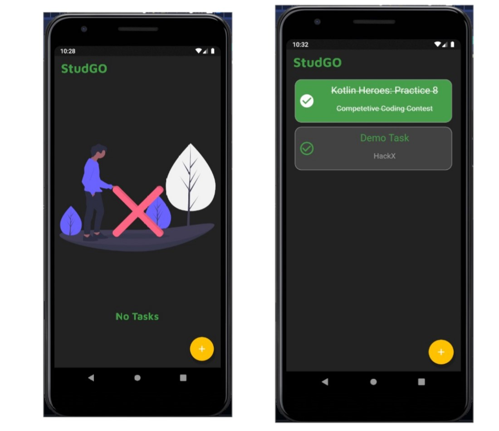
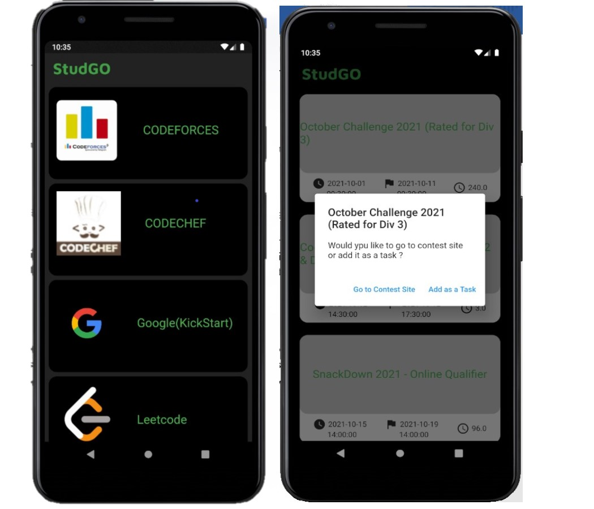
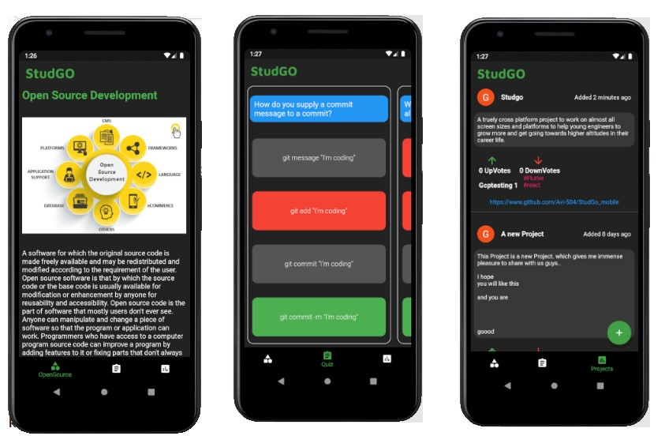
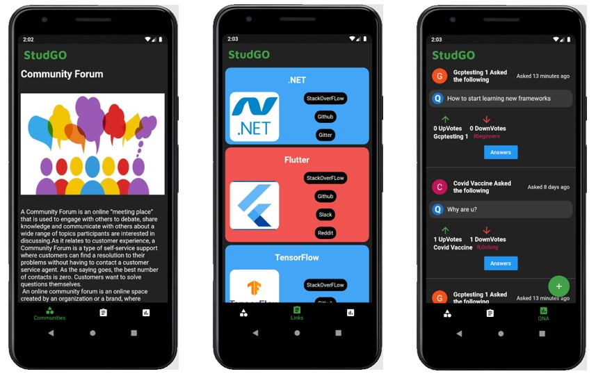
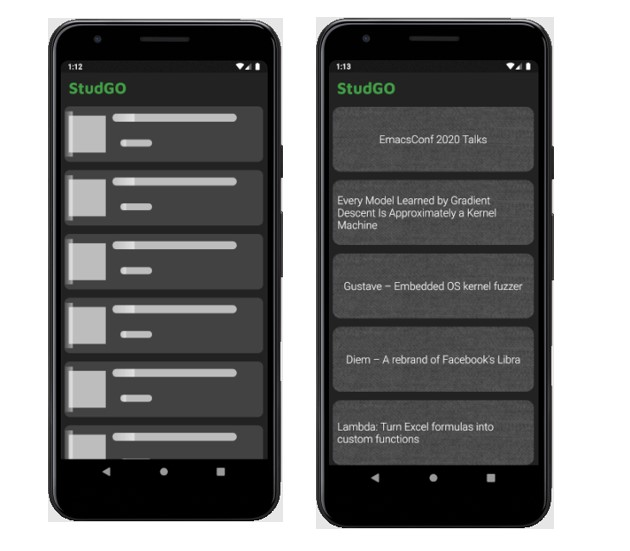
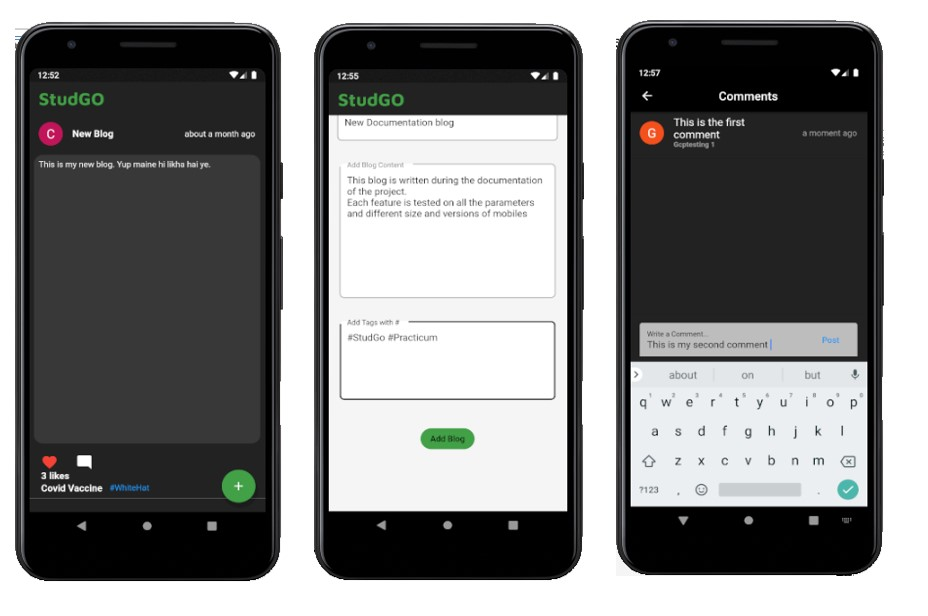

# StudGo <a href="https://drive.google.com/file/d/1lVHFowBA6rfVJNwYAsX1RjrfF4z1vRU9/view">📱</a>
<h3>An Application that aids technical students.</h3>

<p>StudGo provides a simple application for all your technical needs under one hood,we believe that the learning process should be seamless and without hassles of looking for resources all over the web. StudGo just allows us to achieve all of these within a highly dedicated application that can run on Web,IOS or Android.<br>
  <B>So, No more Switching tabs!!</b> 
</p>

<details open="open">
  <summary>Table of Contents</summary>
  <ol>
    <li><a href="#inspiration">Inspiration</a></li>
    <li><a href="#about-the-project">About the project</a></li>
    <li><a href="#features">Features</a></li>
  </ol>
</details>

## Inspiration

A study, led by Prashant Loyalka of Stanford University, analyzed that the 65,000 CS graduates from the United States are outnumbered, but are much more skilled, on average, than the same graduates from China (185,000), India (215,000), and Russia (17,000). The results were published recently in a publication of the Proceedings of the National Academy of Sciences.
<p align="center">
  
</p>
Keeping in mind these stats the project focuses on overcoming this lack of skills in the Indian IT sector by making them aware of the various fields out there where they can excel in their carrier, and make them highly skilled researchers. In short term, the project focuses on the personal development of any student but as a long-term goal, the project aims to build a platform to generate highly skilled resources who can take the nation ahead excel in the field of research.

## About the Project

The main objective is to create a cross-platform project that helps the users (from all technical backgrounds and all tech aspirants) in all-around development enabling them to keep up with the growing demand in their respective sectors.

## Features
<p align="center">
  
</p>
<details open="open">
  <summary>List of Features</summary>
  <ol>
    <li><a href="#to-do">To-Do</a></li>
    <li><a href="#competitive-programming-and-coding-contests">Competetive Programming</a></li>
    <li><a href="#opensource">OpenSource Devlopment</a></li>
    <li><a href="#communities-and-forums">Communities and Forums</a></li>
    <li><a href="#latest-tech-news">Tech News</a></li>
    <li><a href="#blogs">Blogs</a></li>
  </ol>
</details>

## TO DO
Creating Tasks/To-do’s enables to keep track of the user their pending work, reminding them to complete those and stay ahead of the queue at each level in their technical journey.
<p align="center">
  
</p>

## Competitive programming and coding contests
Competitive programming and coding is the best way to practice and expand your current technical skills to the fullest, StudGO provides you with timely notification about all the ongoing and future coding contests from all the top competitive platforms present out there.
<p align="center">
  
</p>

## Opensource
The best way to contribute towards the community is to contribute through opensource projects, contributions in opensource are acceptable almost all around the globe and is a better way to show your grip on the topic, StudGO offers you all the possible opensource projects that you may find worth contributing to.
<p align="center">
  
</p>

## Communities and Forums
Getting stuck when learning something new or not sure how to overcome an error, It’s always good to resolve your doubts, and the best way is to seek help from the creators/developers itself, StudGO provides users with all the major official technical communities and forums to make your technical journey doubt free.
<p align="center">
  
</p>

## Latest Tech News
Keeping your life updated helps you to know the current trend and holds a huge share in building and shaping your future, StudGO enables it users to deep dive into its NewsWall to let them know every happening related to technology at the ease of a single click.

<p align="center">
  
</p>

## Blogs
Got certain achievements or want to share your thoughts, writing blogs is the best way to improve your writing skills and share your valuable thoughts with all, StudGO also provides you with an inbuilt blog system to get your valuable inputs and share that with the community.


<p align="center">
  
</p>

### Prerequisites

You need to have latest version of Flutter and Android Studio installed in your local machine.

-   npm
    ```sh
    flutter upgrade
    ```

### Installation

1. Clone the repo
    ```sh
    git clone https://github.com/Nexus-Bot/StudGo.git
    ```
2. Install Dependencies
    ```sh
    flutter pub get
    ```
3. Run the App on connected Device
    ```sh
    flutter run
    ```

## Getting Started

This project is a starting point for a Flutter application.

A few resources to get you started if this is your first Flutter project:

- [Lab: Write your first Flutter app](https://flutter.dev/docs/get-started/codelab)
- [Cookbook: Useful Flutter samples](https://flutter.dev/docs/cookbook)

For help getting started with Flutter, view our
[online documentation](https://flutter.dev/docs), which offers tutorials,
samples, guidance on mobile development, and a full API reference.
